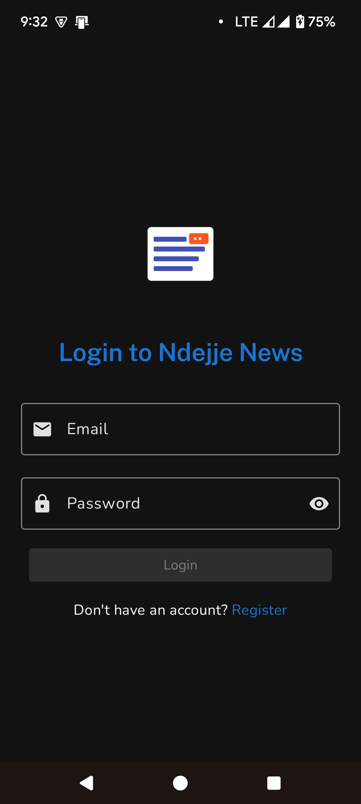
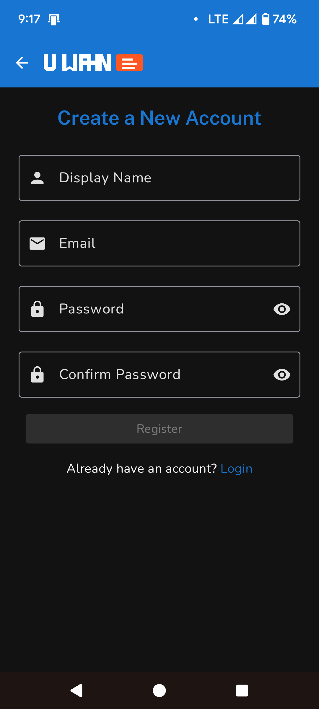
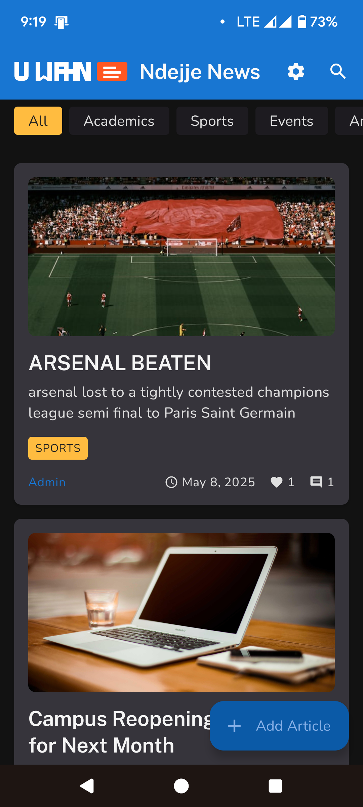
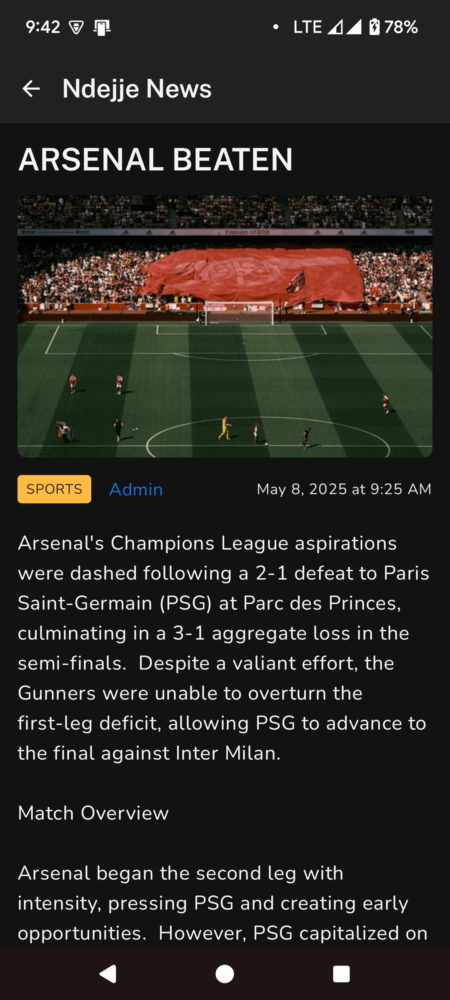
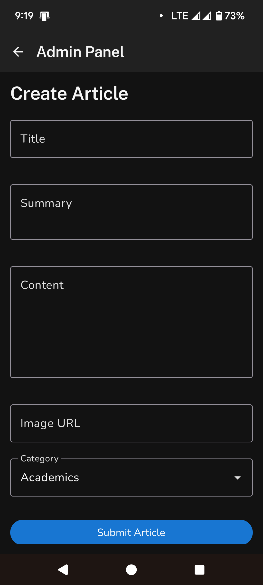

# 📱 UNews: University News Application

## 📑 Table of Contents
1. [Application Purpose](#-application-purpose)
2. [Core Features](#-core-features)
3. [Use Case in Ugandan Context](#-use-case-in-ugandan-context)
4. [Scope and Limitations](#-scope-and-limitations)
5. [Team Contributions](#-team-contributions)
6. [Challenges and Solutions](#-challenges-and-solutions)
7. [Technologies Used](#-technologies-used)
8. [Installation](#-installation)
9. [Future Enhancements](#-future-enhancements)

## 🎯 Application Purpose

UNews is a modern Android application designed to deliver verified news and announcements to university students and staff in real-time. Built with Jetpack Compose and Firebase, this application serves as a centralized platform for delivering academic, administrative, and social updates to the university community.

The application aims to replace traditional, inefficient communication methods (physical notice boards, scattered WhatsApp messages) with a streamlined, verified news source accessible to all university stakeholders. By providing a dedicated platform for university announcements, UNews ensures important information reaches students and staff promptly and reliably.

## 🚀 Core Features

### User Authentication
- Secure login via Firebase Authentication (email/password)
- Role-based access (Admin vs. Student)
- Password reset capabilities

### News Consumption
- **Dynamic News Feed**: Real-time news articles from Firestore
- **Article Details**: Full content with images and formatting
- **Saved Articles**: Bookmark functionality for later reference
- **Search & Filter**: Find content by keywords or categories
- **Comments & Reactions**: Engage with content through discussions and likes

### Admin Functionality
- Article creation and publishing with form validation
- Real-time publishing to Firestore database
- Basic content management capabilities

### User Experience
- Material Design 3 implementation
- Dark/Light theme toggle with persistence
- Offline article caching for uninterrupted access
- Responsive layout for different screen sizes

## Use Case in Ugandan Context

### Problem Statement
Universities across Uganda face significant challenges in communication between administration and students. Current methods include:

1. **Physical Notice Boards**: Information is location-restricted, easily missed, and cannot be updated quickly. Students must physically visit these boards, which are often overcrowded or outdated.

2. **Scattered Social Media**: Important announcements get lost among unrelated messages in WhatsApp groups or social media platforms. The lack of organization means critical information is easily overlooked.

3. **Unreliable Word-of-Mouth**: Critical information becomes distorted as it spreads through informal channels, leading to misinformation and confusion among students.

4. **Unofficial Sources**: Students often receive unverified information from non-authoritative channels, causing uncertainty about the legitimacy of announcements.

These issues have real consequences: students miss registration deadlines, are unaware of schedule changes, and fail to receive important announcements that directly impact their academic journey. For example, at Ndejje University, students have missed examination schedule changes, scholarship opportunities, and campus security alerts due to ineffective communication channels.

### Solution
UNews addresses these challenges by:

- Providing a single, verified source of university information accessible from anywhere
- Enabling real-time updates that reach all students simultaneously via their smartphones
- Creating a searchable archive of all announcements for easy reference
- Allowing interaction through comments for students to seek clarification
- Supporting offline access to previously viewed content for areas with poor connectivity
- Empowering administrators to publish urgent information immediately

For example, when Ndejje University needs to announce an unexpected campus closure due to infrastructure issues, the information can be published immediately to UNews, ensuring all students receive the critical update regardless of their location. Similarly, important academic deadlines, guest lectures, and facility changes can be communicated efficiently through categorized announcements.

## 🔍 Scope and Limitations

### Current Scope
This MVP version of UNews focuses specifically on:

1. **Basic News Delivery System**: A functioning news feed with article details that allows students to read official university announcements
2. **Fundamental User Interaction**: Comments, saves, and reactions to facilitate basic engagement with content
3. **Essential Admin Tools**: Simple article creation and publishing interface for authorized university staff
4. **Core User Experience**: Material Design interface, theme options, and offline functionality for basic usability

The application addresses the primary need for reliable information dissemination within Ugandan universities while maintaining a feasible development scope for our team of three members.

### Limitations

The current implementation deliberately excludes:

1. **Push Notifications**: While valuable for timely alerts, implementation of real-time notifications is beyond the current scope and would require additional backend infrastructure.

2. **Advanced Analytics**: Admin dashboards for content engagement metrics will be addressed in future versions. The current focus is on content delivery rather than measurement.

3. **Direct Image Uploads**: Current version uses image URLs rather than device uploads to simplify the implementation and reduce storage requirements.

4. **Rich Text Editing**: Admin content creation uses basic text fields rather than a full WYSIWYG editor to ensure reliability and simplicity.

5. **Advanced User Management**: Detailed role permissions are simplified to Admin/Student binary roles rather than a more complex hierarchy that might be needed in larger institutions.

6. **Live Events**: Features like live streams for university events are not included due to bandwidth and implementation complexity.

7. **Multimedia Content**: Support for video content is not implemented to keep the application lightweight and accessible on lower-end devices common among Ugandan students.

These limitations were established to create a focused MVP that addresses the core use case of reliable information dissemination while maintaining realistic development scope for a student project.

## 👥 Team Contributions

### Joseph Sserubiri (Team Lead)
- Led overall application architecture and project management
- Implemented Firebase Authentication system with role-based access
- Developed admin article submission functionality
- Created the repository layer for data operations
- Managed Git workflow and code integration

### Mark Kiggundu (UI/UX Developer)
- Designed and implemented UI components with Material 3
- Built navigation system using Navigation Compose
- Created theme toggle functionality (Light/Dark mode)
- Developed saved articles feature
- Implemented responsive layouts for various screen sizes

### Sarah Namulondo (Backend Developer)
- Integrated Firebase Firestore for real-time data synchronization
- Implemented comments and reactions system
- Created search and filter functionality
- Managed state handling with ViewModels
- Implemented offline caching capabilities

## 🛠️ Challenges and Solutions

### Challenge 1: Firebase Authentication with Jetpack Compose
**Problem**: Integrating Firebase Authentication into the Compose lifecycle and maintaining authentication state across screens proved difficult. Initial implementations caused memory leaks and inconsistent UI states.

**Solution**: Created a dedicated AuthViewModel with StateFlow to observe authentication state changes. Used `collectAsState()` in composables to react to auth state changes and implemented proper lifecycle management for Firebase listeners. This approach ensured that authentication state was consistently maintained across configuration changes and navigation events.

### Challenge 2: Efficient Image Loading in Low-Bandwidth Environment
**Problem**: Loading high-resolution images caused performance issues, excessive data usage, and memory leaks, particularly problematic given the limited internet connectivity in many Ugandan university campuses.

**Solution**: Implemented Coil for efficient image loading with caching, lazy loading in LazyColumn, and thumbnail resizing. Added placeholder and error handling for poor network conditions. Images are now progressively loaded and cached, significantly reducing data usage and improving performance on lower-end devices common among students.

### Challenge 3: Handling Offline State for Rural Students
**Problem**: App became unusable when network connection was lost, which is a frequent occurrence for students in rural areas of Uganda.

**Solution**: Leveraged Firestore's offline persistence capabilities to cache previously loaded articles. Implemented UI indicators for offline mode and disabled write operations when offline. Added data synchronization logic for when connection is restored. This ensures students can continue accessing critical information even without consistent internet access.

### Challenge 4: Adapting to Varying Device Capabilities
**Problem**: Wide variation in student device capabilities (from entry-level to high-end smartphones) made it difficult to ensure consistent performance and user experience.

**Solution**: Implemented adaptive loading strategies that detect device capabilities and adjust accordingly. Used lazy loading, minimal animations on lower-end devices, and efficient state management to reduce memory usage. The application now performs well across the range of devices typically used by Ugandan university students.

### Challenge 5: Learning Curve for Jetpack Compose
**Problem**: As a team new to Jetpack Compose, we faced a steep learning curve that impacted development velocity and initially resulted in non-optimal implementations.

**Solution**: Established a structured learning approach with weekly team knowledge-sharing sessions. Created reusable UI components to enforce consistency and reduce duplication. Implemented progressive refactoring sprints to improve code quality as our understanding of Compose deepened. This approach enabled us to overcome the initial learning challenges while maintaining development momentum.

## 💡 Technologies Used

- **UI Framework**: Jetpack Compose with Material 3
- **Architecture**: MVVM with Clean Architecture principles
- **State Management**: ViewModel with StateFlow/MutableState
- **Navigation**: Navigation Compose
- **Database**: Firebase Firestore
- **Authentication**: Firebase Authentication
- **Image Loading**: Coil
- **Async Operations**: Kotlin Coroutines and Flow
- **Persistence**: DataStore for preferences, Firestore offline cache

## 📥 Installation

1. Clone the repository:
   ```
   git clone https://github.com/your-username/UNews.git
   ```

2. Open the project in Android Studio Arctic Fox (2020.3.1) or newer

3. Connect your Firebase project:
   - Add your `google-services.json` to the app directory
   - Ensure Firebase Authentication and Firestore are enabled in your Firebase console

4. Build and run the application on an emulator or physical device

## 🔮 Future Enhancements

- Push notifications for new articles and announcements
- Advanced analytics dashboard for administrators
- Direct image uploads from device
- Rich text editor for article creation
- Expanded role management system
- Live event streaming capabilities
- Video content support
- Multi-language support for international students

## 📌 Project Overview

**UNews** is a state-of-the-art Android application designed using **Jetpack Compose** that delivers verified news and announcements to university students and staff. Developed as a comprehensive final semester project, UNews addresses the lack of centralized communication platforms in Ugandan universities by providing a reliable, structured, and interactive news delivery system.

Built with a focus on user experience and real-time information delivery, UNews leverages **Firebase** as its backend to ensure seamless data synchronization and offline capabilities.

## 🎯 Key Features

### 🔐 Authentication & User Management
- **Email/Password Login**: Secure authentication via Firebase Auth
- **Role Separation**: Student and Admin roles with different access permissions
- **User Profiles**: Display name and profile management

### 📰 News Feed & Content
- **Dynamic News Feed**: Real-time article updates using Firestore
- **Category Filtering**: Filter news by academics, sports, events, and announcements
- **Rich Article Display**: Full-featured article reading with images and formatting
- **Interactive Elements**: Like/react to articles and post comments

### 🔍 Search & Discovery
- **Powerful Search**: Find articles by title, content, or keywords
- **Advanced Filtering**: Combine search with category filters
- **Saved Articles**: Bookmark and save interesting articles for later reading

### 🌙 Personalization & Settings
- **Dark Mode Toggle**: Switch between light and dark themes with persistence
- **Offline Access**: Read previously loaded content without internet connection
- **Responsive Design**: Optimized for various screen sizes and orientations

### 👑 Admin Features
- **Content Management**: Create and publish new articles
- **Form Validation**: Robust validation for article submissions
- **Real-time Publishing**: Instant distribution to all users

## 🎨 UI/UX Design

UNews features a modern, cohesive design built on **Material Design 3** principles:

- **Custom Color Palette**: Carefully selected primary, secondary, and accent colors
- **Typography System**: Custom fonts (Nunito and Public Sans) for improved readability
- **Component Consistency**: Uniform styling of cards, buttons, and inputs
- **Responsive Layouts**: Adaptable design for various screen sizes
- **Subtle Animations**: Entrance and transition animations for enhanced UX
- **Dark Mode Support**: Complete theme switching with persistent user preference

## 🧱 Architecture & Technical Implementation

### MVVM Architecture
The application follows the Model-View-ViewModel (MVVM) pattern:

```
┌─────────────────┐        ┌─────────────────┐        ┌─────────────────┐
│     UI Layer    │◄─────► │  ViewModel Layer│◄─────► │   Data Layer    │
│  (Composables)  │        │ (State & Logic) │        │ (Repositories)  │
└─────────────────┘        └─────────────────┘        └─────────────────┘
```

- **Model**: Data classes and repositories for Firebase interactions
- **View**: Jetpack Compose UI components and screens
- **ViewModel**: Manages UI state and business logic, survives configuration changes

### Key Technologies
- **Jetpack Compose**: For declarative UI building
- **Navigation Compose**: Type-safe navigation between screens
- **ViewModel & StateFlow**: Reactive state management
- **Firebase Authentication**: User login and role management
- **Firebase Firestore**: Real-time database with offline support
- **DataStore**: For persisting user preferences
- **Coil**: Efficient image loading and caching
- **Material 3**: Modern UI components and theming

## 📁 Project Structure

```
com.example.ndejjenews/
├── data/
│   ├── model/               # Data classes
│   │   ├── Comment.kt
│   │   ├── NewsArticle.kt
│   │   └── User.kt
│   └── repository/          # Data sources and repositories
│       ├── AuthRepository.kt
│       ├── AuthRepositoryImpl.kt
│       ├── NewsRepository.kt
│       └── NewsRepositoryImpl.kt
├── ui/
│   ├── components/          # Reusable UI components
│   │   ├── CommentItem.kt
│   │   ├── NewsCard.kt
│   │   ├── TextInput.kt
│   │   └── ...
│   ├── navigation/          # Navigation graph and routes
│   │   └── AppNavigation.kt
│   ├── screens/             # App screens
│   │   ├── admin/
│   │   │   └── AdminScreen.kt
│   │   ├── auth/
│   │   │   ├── LoginScreen.kt
│   │   │   └── RegisterScreen.kt
│   │   ├── news/
│   │   │   ├── ArticleDetailsScreen.kt
│   │   │   ├── HomeScreen.kt
│   │   │   ├── SavedArticlesScreen.kt
│   │   │   └── SearchScreen.kt
│   │   └── settings/
│   │       └── SettingsScreen.kt
│   └── theme/               # Theme configuration
│       ├── Color.kt
│       ├── Shape.kt
│       ├── Theme.kt
│       └── Type.kt
├── utils/                   # Utility classes
│   ├── Constants.kt
│   ├── Resource.kt
│   └── Validators.kt
├── viewmodel/               # ViewModels
│   ├── AuthViewModel.kt
│   ├── NewsViewModel.kt
│   └── ThemeViewModel.kt
└── MainActivity.kt          # Application entry point
```

## 🛠️ Development Environment

### Prerequisites
- Android Studio Iguana (2023.2.1) or higher
- JDK 11 or higher
- Android SDK 35
- Minimum SDK 24 (Android 7.0 Nougat)
- Google Firebase account

### Setting Up the Project

1. **Clone the repository**:
   ```bash
   git clone https://github.com/your-username/unews.git
   cd unews
   ```

2. **Firebase Setup**:
   - Create a new Firebase project at [firebase.google.com](https://firebase.google.com)
   - Add an Android app with package name `com.example.ndejjenews`
   - Download `google-services.json` and place it in the app/ directory
   - Enable Authentication with Email/Password sign-in method
   - Create a Firestore database with the following collections:
     - `users`: For user information
     - `articles`: For news articles
     - `comments`: For article comments

3. **Configure Build Environment**:
   - Open the project in Android Studio
   - Sync Gradle dependencies
   - Ensure the Google Services plugin is properly applied

4. **Run the Application**:
   - Connect an Android device or use an emulator
   - Click the "Run" button in Android Studio

## 🔧 Code Conventions & Best Practices

### Architectural Guidelines
- **Repository Pattern**: All data operations are abstracted through repositories
- **Single Responsibility**: Each class has a clear, focused responsibility
- **State Hoisting**: UI state is hoisted to ViewModels for configuration change survival
- **Unidirectional Data Flow**: State flows down from ViewModel to UI

### Code Style
- **Kotlin Conventions**: Following standard Kotlin coding conventions
- **Descriptive Naming**: Clear, descriptive names for classes and functions
- **Comprehensive Comments**: Documented public APIs with KDoc comments
- **Resource Externalization**: No hardcoded strings or dimensions

### Testing
- **ViewModel Testing**: State changes and business logic are testable
- **Repository Testing**: Data operations are isolated for testing
- **UI Testing**: Composables are designed for testability

## 🚀 Firebase Integration Details

### Authentication
- Email/Password authentication with Firebase Auth
- User profile management with display name
- Admin role determination via Firestore user documents

### Firestore Database
- **Collections Structure**:
  - `users/{userId}`: User profiles with isAdmin flag
  - `articles/{articleId}`: News articles with title, content, etc.
  - `comments/{commentId}`: Comments linked to articles and users
  - `users/{userId}/savedArticles/{articleId}`: Saved articles tracking

- **Offline Persistence**: Enabled for reading articles without connectivity
- **Security Rules**: Proper rules for data access control (example below)

## 📱 Screenshots

<div align="center">
  <h3>Login Screen</h3>
  
  
  <h3>Register Screen</h3>
  
  
  <h3>News Feed</h3>
  
  
  <h3>Article Details</h3>
  
  
  <h3>Admin Dashboard</h3>
  
</div>

## 🔍 Troubleshooting & Common Issues

### Firebase Connection Issues
- Ensure `google-services.json` is properly placed in the app/ directory
- Check internet connectivity and Firebase project status
- Verify Firebase dependencies are correctly added to `build.gradle.kts`

### Build or Compilation Errors
- Ensure Android Studio is updated to the latest version
- Update Kotlin plugin and Compose compiler versions
- Sync project with Gradle files

### Authentication Problems
- Verify Firebase Authentication is enabled with Email/Password sign-in method
- Check email format and password length (minimum 6 characters)
- Review Firebase console logs for authentication errors

## 🚧 Future Enhancements

- **Push Notifications**: Real-time alerts for new articles and announcements
- **Role-Based Access Control**: Enhanced role system with Firebase Auth Claims
- **Image Upload**: Direct image uploads from device for admin users
- **Analytics Dashboard**: Engagement metrics for administrators
- **Comment Moderation**: Tools for managing user comments
- **Rich Text Editor**: Enhanced article creation with formatting options
- **Localization**: Support for multiple languages

## 👨‍💻 Contributors

- [Your Name] - Lead Developer

---

<div align="center">
  <p>© 2023-2025 UNews Team - Final Year Project</p>
</div> 


